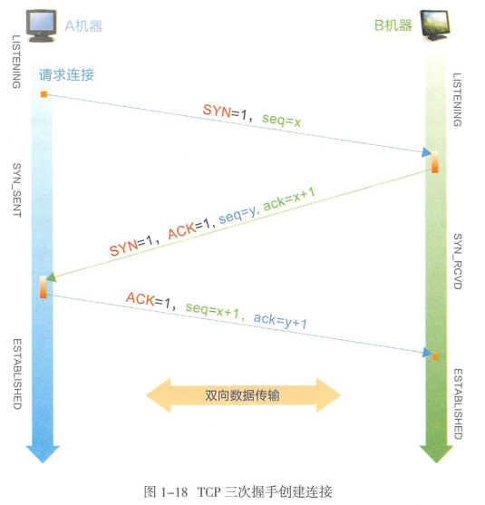
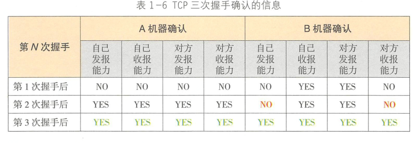
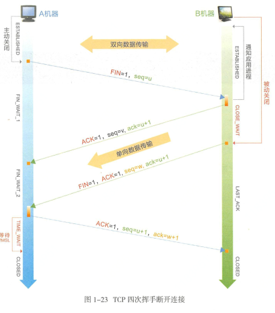

# TCP

#### TCP连接建立

连接三次握手也是为了防止出现请求超时

#### TCP断开连接

TIME_WAIT存在的原因：

1. 确认被动关闭方能够顺利进入 CLOSED 状态
2. 防止失效请求 

因为 TIME_WAIT 状态无法真正释放句柄资源。服务器可以将TIME_WAIT 超时时间调小。/etc/sysctl.conf  net.ipv4.tcp_fin_timeout = 15(建议小于30s)